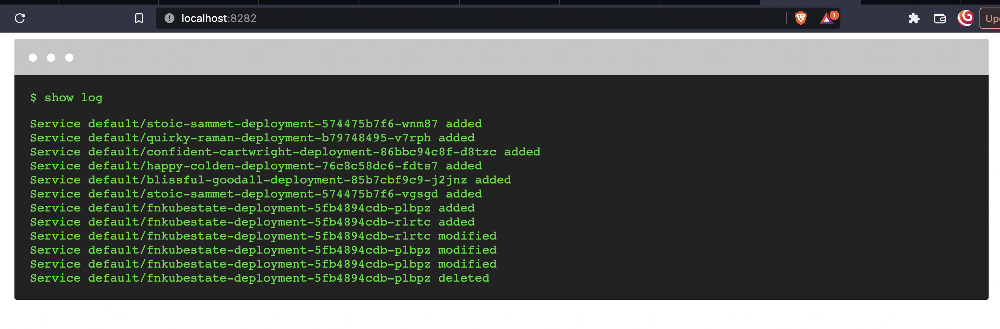

## FN-KUBE-STATE

A small utility to show the state of k8s cluster


## Local testing steps (For Mac):

### Cluster preparation
> Download kind

```bash
brew install kind
```

> Create cluster
```bash
kind create cluster --name fn-kubestate-cl
```

> Set and get the kubectl context
```bash
kubectl config set-context kind-fn-kubestate-cl
kubectl cluster-info --context kind-fn-kubestate-cl
```

> Quick check to see the nodes
```bash
kubectl get nodes
```

> Add test deployments
```bash
kubectl apply -f task/services.yaml
```

> Check the pods
```bash
kubectl get pods
```

### Usage from outside cluster
> Run the go file from outside the cluster
> Make sure go is installed
```bash
go mod tidy

go run main.go
#or
go build -v -o fnkubestate cmd/main.go
./fnkubestate
```

> Go to browser
> Open following endpoints
`http://localhost:8282/` -> To get live status
`http://localhost:8282/services` -> To get list of services
`http://localhost:8282/services/beta` -> To get list of services by application group


### Usage from inside cluster

#### Build docker image and push to registry. [Skip if already pushed]
```bash
go mod tidy

# Prod build (dev build below)
docker build --rm -t <username>/fn-kube-state:latest .

docker login -u <username>
# Enter token on prompt

docker push <username>/fn-kube-state
```

#### Cluster deployment and usage

```bash

# Allow internal pods to access cluster api [Warning: NOT IN PROD]
kubectl create clusterrolebinding serviceaccounts-cluster-admin \
  --clusterrole=cluster-admin \
  --group=system:serviceaccounts

kubectl apply -f yamls/config.yaml

# Replace the <username> in yamls/webapp.yaml 
kubectl apply -f yamls/webapp.yaml 

kubectl get pods
kubectl describe <pod-name>
kubectl logs <pod-name>

# To access the api from host machine
kubectl port-forward service/fnkubestate-service 8282:8282
```

> Go to browser
> Open following endpoints
`http://localhost:8282/` -> To get live status
`http://localhost:8282/services` -> To get list of services
`http://localhost:8282/services/beta` -> To get list of services by application group

#### Dev mode
```bash
# Dev build
docker build --rm -t <username>/fn-kube-state:latest -f DockerfileDev .

# Exec into pod
kubectl exec -it <pod-name> -- /bin/sh
# Run manually
go run cmd/main.go
```
#### Cleanup

```bash
kubectl delete -f yamls/webapp.yaml
```


#### Screenshot


